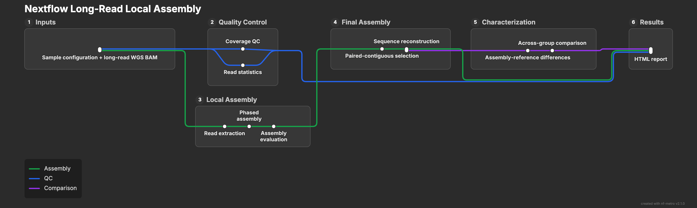

# Nextflow Long-Read Local Assembly

A Nextflow DSL2 workflow for local, haplotype-resolved assembly of long-read whole-genome sequencing (WGS) data on SLURM-based HPC systems.

The workflow performs regional read extraction, phased assembly, reference-based assembly evaluation, optional structural haplotyping, sequence reconstruction, cross-dataset comparison, and automated reporting. PacBio HiFi (`PB`) and Oxford Nanopore (`ONT`) WGS data are supported.

---

## Goal

Provide a reproducible and configurable workflow for local assembly and characterization of structurally complex genomic regions from long-read WGS data. The human **FCGR2/3** locus is included as a test case.

---

## Workflow



Only assembly runs in which **both hap1 and hap2 are contiguous** are retained for final target-region sequence reconstruction. When the same sample is represented by multiple datasets, the resulting assemblies can also be compared across groups.

---

## Implementation

The workflow is implemented in **Nextflow DSL2** for execution with **SLURM** and **Apptainer/Singularity**. Analysis steps use **Samtools**, **Hifiasm**, **Minimap2**, **Python**, and a custom **Rust `gfa2fasta`** utility.

Analysis dependencies are packaged in `long_read_local_asm.sif`.

### Requirements

- **Nextflow v25.10.3**
- **Apptainer/Singularity** (tested with Apptainer v1.4.2-1)
- **SLURM**
- coordinate-sorted and indexed long-read WGS BAM files
- indexed reference genome FASTA

---

### Core Workflow Files

| File | Description |
|---|---|
| `main.nf` | Defines the main DSL2 workflow, channels, analysis branches, sample × flank expansion, and connections between modules. |
| `nextflow.config` | Defines Nextflow execution settings, SLURM process resources, container use, and workflow-level configuration. |
| `submit_local_asm_workflow.sh` | User-facing submission script. Parses workflow arguments and submits the Nextflow controller as a SLURM job. |
| `run_nextflow.sh` | Loads the required HPC environment and launches `main.nf` with the parameters passed by the submission script. |
| `long_read_local_asm.sif` | Pre-built Apptainer/Singularity image containing the software environment used by workflow processes. |

Additional documentation for individual components is provided within the corresponding directories.

---

## Quick Start

### 1. Clone the Repository

```bash
git clone https://github.com/nadams2ncsu/nextflow-long-read-local-assembly.git
cd nextflow-long-read-local-assembly
```

### 2. Configure Samples

Edit the example sample configuration at `config/samples.tsv`.

The sample table contains one row for each input dataset and genomic region.

| Column | Description |
|---|---|
| `sample` | Sample ID |
| `group` | Dataset, consortium, sequencing source, batch, or comparison-group label |
| `bam` | Path to coordinate-sorted and indexed long-read BAM |
| `gene` | Gene or genomic-region identifier |
| `coordinates` | Target coordinates in the coordinate system of the input BAM (`chr#:START-END`) |
| `data_type` | Sequencing data type: `ONT` or `PB` |
| `flanks` | Flanking-region size(s), in kb |
| `qc_config` | Path to locus-specific coverage QC YAML |
| `haplotype_config` | Path to optional structural haplotype YAML, or `NA` |

Supported flank sizes are `50, 100, 200, 300, 400, 500, 1000` kb.

Multiple flank sizes can be supplied as a comma-separated list such as `100,200,400`, or use `all` to evaluate all supported flank sizes.

### 3. Configure Locus-Specific QC

Coverage QC configurations are provided in `config/qc/`.

Each YAML defines the genomic intervals used to evaluate coverage for a target locus. Different coordinate systems can be associated with different input groups when the original BAMs were aligned to different references.

### 4. Optional Structural Haplotyping

Known structural haplotypes can be defined in `config/haplotypes/`.

These configurations describe the target evaluation region and expected structural events used for locus-specific haplotype classification.

For regions where structural haplotyping is not required, set `haplotype_config` to `NA` in `config/samples.tsv`.

### 5. Run

Make the workflow scripts and modules executable:

```bash
chmod +x submit_local_asm_workflow.sh run_nextflow.sh
chmod +x bin/*
chmod +x modules/*
```

Submit the workflow:

```bash
./submit_local_asm_workflow.sh config/samples.tsv /path/to/reference/genome.fasta
```

The submission script launches the long-read local assembly workflow as a SLURM job. Nextflow manages sample × flank expansion and submits individual workflow processes to SLURM.

---

## Workflow Parameters

The workflow provides default analysis parameters that can be changed when the workflow is submitted.

| Parameter | Default | Description |
|---|---:|---|
| `--hifiasm_args` | (--ont) -t --hg-size -o | Can provide additional arguments or override |
| `--minimap2_args` | -ax asm5 --secondary=no --eqx| Can only change preset (asm10, asm20) |
| `--large_indel_threshold` | `40000` | Minimum insertion or deletion size, in bp, classified as a large structural difference|
| `--min_region_coverage` | `0.80` | Minimum fraction of the target evaluation region required for a contiguous assembly |
| `--min_median_read_length` | `5000` | Minimum median regional read length, in bp, used for read-level QC |
| `--group_similarity_threshold` | `90.0` | Minimum sequence similarity percentage used for across-group comparison QC |
| `--outdir` | `results` | Directory used for final workflow outputs |
| `--queue_size` | `10` | Maximum number of Nextflow tasks submitted to SLURM concurrently |

Assembly flank sizes are configured per input row in `samples.tsv` rather than as a workflow-wide parameter.

### Modifying Parameters

Parameters can be supplied after the required sample table and reference arguments.

For example:

```bash
./submit_local_asm_workflow.sh \
    config/samples.tsv \
    /path/to/reference/genome.fasta \
    --large_indel_threshold 50000 \
    --min_region_coverage 0.90 \
    --min_median_read_length 10000 \
    --group_similarity_threshold 97.0 \
    --queue_size 15 \
    --outdir my_results
```

Additional hifiasm or minimap2 arguments can also be supplied when alternative assembly or alignment behavior is required.

For example:

```bash
./submit_local_asm_workflow.sh \
    config/samples.tsv \
    /path/to/reference/genome.fasta \
    --hifiasm_args "..." \
    --minimap2_args "..."
```

The default parameters are intended as starting values for the supplied FCGR2/3 workflow and test dataset. Parameters may require adjustment for other genomic regions, sequencing datasets, or HPC environments.

---

## Configuration

Workflow behavior can be modified at several levels.

### Sample-Level Configuration

`config/samples.tsv` controls:

- input BAMs,
- input groups,
- target regions,
- sequencing data type,
- assembly flank sizes,
- coverage QC configuration, and
- optional structural haplotype configuration.

### Locus-Specific Configuration

Files in `config/qc/` define coverage intervals for each target locus and reference coordinate system.

Files in `config/haplotypes/` optionally define:

- downstream evaluation coordinates,
- expected structural events,
- structural haplotype definitions, and
- locus-specific assembly evaluation settings.

### Workflow and HPC Configuration

`nextflow.config` defines SLURM execution settings and process-specific computational resources.

These settings can be modified for a different HPC environment, including CPU and memory requirements for individual workflow processes.

See `config/README.md` for additional information about sample, QC, haplotype, and coordinate configuration.

---

## Coordinate Handling

The workflow may accept input BAMs aligned to different reference assemblies.

The `coordinates` field in `samples.tsv` specifies the target region on the reference used by each **input BAM**. These coordinates are used for regional read extraction and input read statistics.

After assembly, assembled contigs are aligned to the **workflow reference** supplied when the pipeline is launched. When a structural haplotype configuration is provided, its `evaluation_coordinates` define the corresponding target region on this reference for downstream assembly evaluation and sequence reconstruction.

This allows datasets aligned to different reference assemblies to be assembled independently and evaluated against a common workflow reference.

---

## Outputs

Final workflow outputs are written to `results/` by default.

| Output | Description |
|---|---|
| **Coverage QC** | Coverage measurements across configured locus-specific intervals |
| **Read statistics** | Regional long-read statistics for each input dataset |
| **Assembly summary** | Assembly status, sequence characteristics, and optional structural haplotype assignments |
| **Reconstructed FASTA** | Final hap1 and hap2 target-region sequences from paired-contiguous assemblies |
| **Assembly-reference differences** | Sequence differences between paired-contiguous assemblies and the workflow reference |
| **Across-group comparisons** | Sequence and assembly-reference difference concordance between independently generated assemblies |
| **HTML report** | Interactive summary of assembly outcomes, QC, sequence comparisons, and assembly-reference difference concordance |

Intermediate files generated during execution are maintained by Nextflow in the `work/` directory.

Nextflow execution metadata, including the DAG, trace, timeline, and execution report, are written to `results/pipeline_info/`.

---

## Test Dataset

A downsampled test dataset is provided in `test/`.

The test dataset uses the same long-read WGS samples represented in the main workflow results, with only reads surrounding the human FCGR2/3 region retained. This reduces the input size while preserving the reads required to exercise the local assembly workflow. This reduces the input size while preserving the reads required to exercise the local assembly workflow.

Test components include:

- `test/data/` — reduced long-read BAM files and indexes
- `test/reference/` — chromosome 1 GRCh38 reference and index
- `test/config/` — test sample and locus-specific configurations
- `test/logs/` — example workflow execution logs
- `test/test_results/` — representative outputs from a completed test run

### Run the Test Dataset

From the repository root:

```bash
./submit_local_asm_workflow.sh \
    test/config/samples.tsv \
    test/reference/GRCh38_chr1.fasta
```

The test dataset exercises the same assembly, evaluation, reconstruction, comparison, and reporting steps as the full workflow.

Because the test BAMs contain reads only around the FCGR2/3 region, genome-wide coverage metrics are expected to be low and may trigger coverage QC warnings. These warnings are expected for the reduced test dataset.

The resulting outputs can be compared with the representative outputs in `test/test_results/`.

---

## Paired-Contiguous Assemblies

Final sequence reconstruction requires both phased assemblies for a `sample + group + gene + flank` combination to be classified as **contiguous**.

If either haplotype fails this requirement, neither haplotype from that assembly run is retained as a final reconstructed assembly.

Samples represented by only one group can still produce final reconstructed sequences. Multiple groups are required only for across-group comparison.
